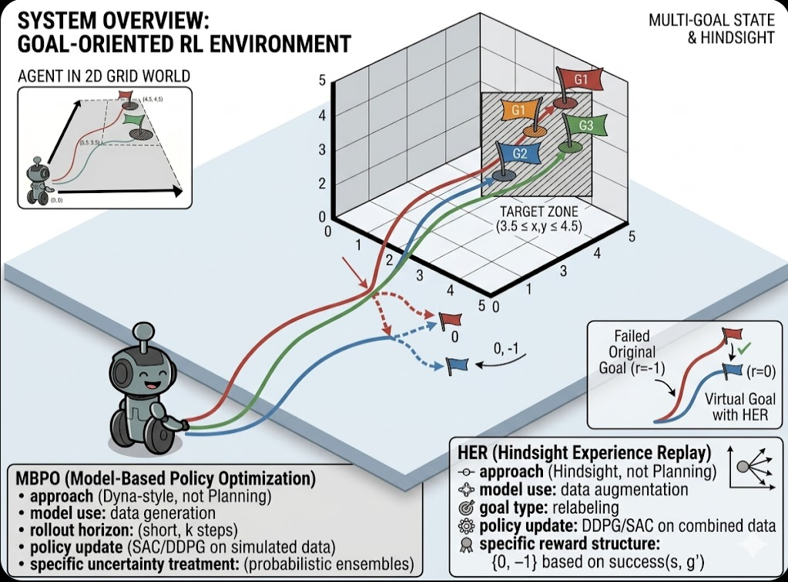
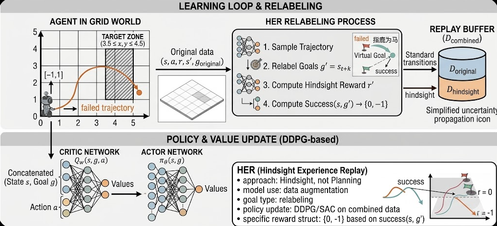
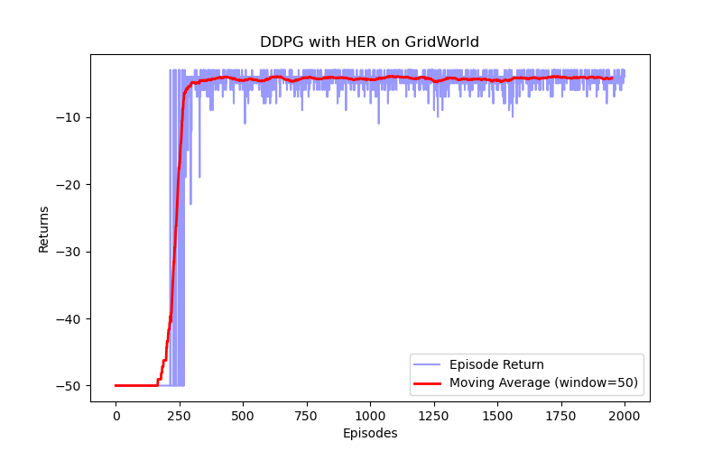
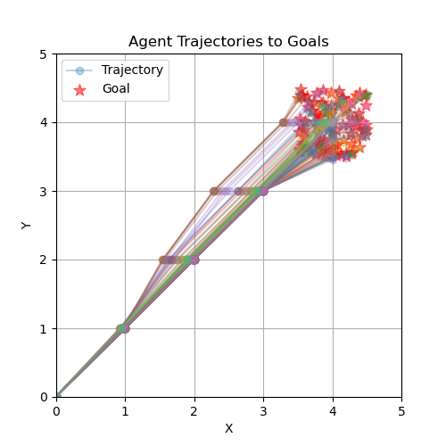

# HER_DDPG_Project




## Overview

### Key Concepts
- Previously, we've learned classical deep reinforcement learning algorithms like DDPG, PPO, and SAC, which perform well on individual tasks but are limited to specific objectives.
- For complex composite tasks, traditional reinforcement learning algorithms often struggle to train effective policies.
- This project introduces Goal-oriented Reinforcement Learning (GoRL) and the Hindsight Experience Replay (HER) algorithm.
- GoRL learns a policy that works under different goal conditions, enabling it to solve more complex decision-making tasks.

A target-oriented reinforcement learning project implementing Deep Deterministic Policy Gradient (DDPG) with Hindsight Experience Replay (HER) for goal-directed tasks. This project trains an agent to navigate a GridWorld environment, leveraging HER to convert failed attempts into valuable learning experiences, ideal for studying sparse-reward scenarios and continuous action control.

## Installation

1. Clone the repository:
   ```bash
   git clone https://github.com/xiaoshengdianzi/HER_DDPG_Project.git
   cd HER_DDPG_Project
   ```

2. Create and activate virtual environment:
   ```bash
   python -m venv .venv
   .venv\Scripts\activate
   ```

3. Install dependencies:
   ```bash
   pip install -r requirements.txt
   ```

## Usage

### Training Command
```bash
python train_her_ddpg.py
```

### Training Parameters
- `actor_lr`: Actor network learning rate (default: 1e-3)
- `critic_lr`: Critic network learning rate (default: 1e-3)
- `hidden_dim`: Hidden layer dimension (default: 128)
- `state_dim`: State dimension (default: 4)
- `action_dim`: Action dimension (default: 2)
- `action_bound`: Action bound (default: 1)
- `sigma`: Exploration noise (default: 0.1)
- `tau`: Target network update rate (default: 0.005)
- `gamma`: Discount factor (default: 0.98)
- `num_episodes`: Number of training episodes (default: 2000)
- `n_train`: Number of training steps per episode (default: 20)
- `batch_size`: Batch size (default: 256)
- `minimal_episodes`: Minimal episodes before training (default: 200)
- `buffer_size`: Replay buffer size (default: 10000)

## Results

### Training Performance


### Agent Trajectories

- This figure illustrates how State $(x, y)$ and Goal $(g_x, g_y)$ jointly drive the agent's decisions in the 2D GridWorld environment.

## Project Structure
```
├── train_her_ddpg.py      # Main training script
├── ddpg.py                # DDPG algorithm implementation
├── her_replay.py          # Hindsight Experience Replay implementation
├── grid_world_env.py      # GridWorld environment
├── networks.py            # Neural network definitions
├── requirements.txt       # Project dependencies
├── README.md              # Project documentation
├── LICENSE                # License file
├── .gitignore             # Git ignore rules
├── images/                # Visualization images
│   ├── train_result.png   # Training results visualization
│   ├── trajectory.png     # Agent trajectories visualization
│   ├── image1.png         # Additional result image 1
│   └── image2.png         # Additional result image 2
```

## Contributing
Contributions are welcome! Please feel free to submit a Pull Request.

## License
This project is licensed under the MIT License - see the LICENSE file for details.